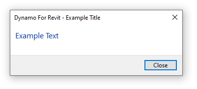
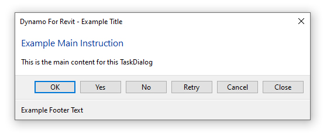

# 4.14 Feedback: TaskDialogs

#### Tools Have Audiences

When a user starts using your custom scripts, they might not know when they've finished executing or whether they ran successfully. Even a small element of visual feedback can go a long way in making your tools more usable.

#### Creating a TaskDialog

[TaskDialogs](https://www.revitapidocs.com/2015/853afb57-7455-a636-9881-61a391118c16.htm) are Revit's API class for providing verbose user feedback. They can be executed with a single line of code, like so:

```python
#Boilerplate Code

TaskDialog.Show("Example Title", "Example Text")
```

Which causes Revit to display this dialog box: 



TaskDialogs are useful to provide a level of feedback to a user - perhaps you want to report whether the script ran successfully or encountered any errors.

#### Customising the TaskDialog

The above example implemented a bare-minimum TaskDialog, but these can also be edited via the class' properties to make something richer, like so:

```python
#Boilerplate Code

task_dialog = TaskDialog("Example Title")
task_dialog.CommonButtons = TaskDialogCommonButtons.Cancel | TaskDialogCommonButtons.Ok | TaskDialogCommonButtons.Close |     TaskDialogCommonButtons.No | TaskDialogCommonButtons.Yes | TaskDialogCommonButtons.Retry | TaskDialogCommonButtons.None
task_dialog.FooterText = "Example Footer Text"
task_dialog.MainInstruction = "Example Main Instruction"
task_dialog.MainContent = "This is the main content for this TaskDialog"

task_dialog.Show()
```

Which display the following



