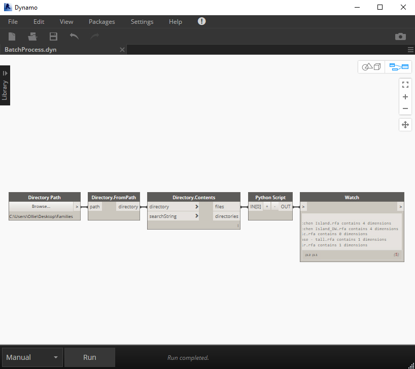

# 4.9 Opening & Closing External Files

**Batch Processing Revit Files**

One of the most powerful aspects of Revit’s API is the ability to open, close, edit and save documents in an automated way. Best of all, we can achieve this 'headlessly', which means opening the Revit [document's database](introduction-to-revits-api.md#introduction-to-revits-api) without any GUI component. Generally speaking, working with documents in this way is perhaps 20-30 times faster than if a user were doing so - this means we can build custom behaviours that involve rapidly batch processing many files.

#### Targeting Many Documents

In a nutshell, batch-processing files means we'll undertake the same series of behaviours on a list of document objects, looping through each one in turn. In rough terms, this means the following:

1. Create a list of Revit FilePath objects, based on the file paths of your target documents.
2. Iterate through this list.
3. Use the Revit API's Open\(\) method to open the file and create a handle for this open document.
4. Open a transaction which targets our newly-opened document via its handle.
5. Make various API calls as desired, depending on what you want to do.
6. Close the Transaction we opened in step 4
7. Close the document, saving it if desired.

#### Worked Example

Let's say I have a folder of 5 Revit Family \(.rfa\) files on my desktop and I want to open each one in turn and report back the number of dimensions in that file. My Dynamo definition would be:



I simply use the Directory Path node to point at the folder of families on my desktop, read its content and input the filepaths of each Revit family \(.rfa\) file, as a string to a Python Script node. For reference, the exact same workflow is also achievable using Revit model \(.rvt\) files.

The Python Script node contains the following:

```python
#Boilerplate Code
input_paths = IN[0]

open_options = OpenOptions() #Creating a new OpenOptions object
report = [] #Creating an empty list, which will contain our final report

for path in input_paths: #Iterating through each filepath string
	filepath = FilePath(path) #Creating a Revit FilePath object from this
	family_doc = app.OpenDocumentFile(filepath, open_options) #Telling the Revit application to open the file we specify)
	dimensions = FilteredElementCollector(family_doc).OfCategory(BuiltInCategory.OST_Dimensions).WhereElementIsNotElementType().ToElements() #Creating a FilteredElementCollector to gather dimension elements
	number_dimensions = len(dimensions) #Counting the number of dimensions
	report.append("File {} contains {} dimensions".format(path, number_dimensions)) #Creating a formatted string for our report
	family_doc.Close(False) #Finally, closing the document (False = without saving)

OUT = report #Outputting the report we generated
```

Quite a lot just happened there, so let's break down the code above. 

\(Unsure what to put as your [Boilerplate Code](../getting-started/boilerplate-setup-code.md)? Find out more about importing dependencies here\)

**Line 2:** We use the[ IN keyword](../getting-started/basics-input-and-output.md) to input a list of filepaths to the node, as strings.  
**Line 4:** Revit's [OpenOptions](https://apidocs.co/apps/revit/2019/c0004971-3810-eeb8-72bd-e116886ec3c8.htm) class is used to specify the way in which we open a Revit document using the API. There's a lot of variables we can specify: do we show the worksets dialog? Do we audit the file while opening? We can use our open\_options handle to set these options.  
**Line 5:** This is simply creating an empty list, which we'll add things to and then output later  
**Line 7:** Here, we're using a for loop to iterate through our list of string filepaths from Line 2.  
**Line 8:** The [FilePath](https://apidocs.co/apps/revit/2019/4b02e613-2848-b0df-0de0-a77da2529d66.htm) class is a Revit API class, which is used to specify a Revit model file saved on a local or network location \(i.e. is has a file path\). Since the [OpenDocumentFile\(\) ](https://apidocs.co/apps/revit/2019/5716f206-98ee-0490-4c6c-f0cdd6644190.htm)method specifically requires a FilePath object as an argument, we'll need to create a FilePath object using the string filepath as we do above. Since we're in a for loop, we'll create a new FilePath object for each filepath string in the list we're iterating through.  
**Line 9:** Having created the OpenOptions and FilePath object, we can now tell the Revit application to headlessly-open the file we're processing. By default, the files open headlessly.  
**Lines 10-11:** For this example, we're counting the number of Dimension elements in each .rfa file. I quickly gather these using a FilteredElementCollector. See more about [using FilteredElementCollectors here](fetching-revit-elements.md). Then, we simply use Python's len\(\) function to get the number of items collected.  
**Line 12:** Having retrieved the number of dimensions, I create a formatted string \(syntax differs between Python versions. Since we're using [IronPython](../hello-python/what-is-ironpython.md), this is the Python 2.X version\). I add this string to the report list we'll be outputting from the Python Script node.  
**Line 13:** Finally, we end each loop by closing the family document we've opened. This can be achieved using the document's [Close\(\) method](https://apidocs.co/apps/revit/2019/da2f27b9-7255-4950-82a2-86e1432ff9f0.htm), and passing in a Boolean as an argument to signify whether we save the document upon closing.  
**Line 15:** We use the [OUT keyword](../getting-started/basics-input-and-output.md) to output the report list from the node.

For reference, output from the Python Script node looks like this: 

* "File C:\Users\Ollie\Desktop\Families\4500\_Kitchen Island.rfa contains 4 dimensions"
* "File C:\Users\Ollie\Desktop\Families\4500\_Kitchen Island\_DW.rfa contains 4 dimensions"
* "File C:\Users\Ollie\Desktop\Families\A1 metric.rfa contains 0 dimensions"
* "File C:\Users\Ollie\Desktop\Families\aalto vase - tall.rfa contains 1 dimensions"
* "File C:\Users\Ollie\Desktop\Families\Bar Chair.rfa contains 1 dimensions"

#### Summary

The example workflow above just achieved quite a lot; in a few lines of code, we were able to read the contents of a folder, open its Revit family documents in turn and read their databases. Running this code takes a few seconds - manually checking each file would take many times longer and be a pretty dull task!

The above workflow can act as a skeleton. Perhaps you want to access other kind of elements? Perhaps you want to add, delete or modify the documents. Providing you're [opening and closing a transaction](working-with-transactions.md) for each file, you should be able to do quite a lot with this starter code.

