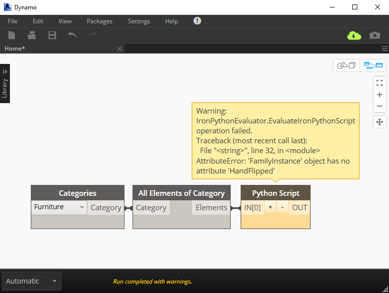

# 4.4 Unwrapping Revit Elements

#### **About Unwrapping**

Unwrapping elements? Now there's some weird terminology! In short: Revit elements brought into a node will need to be 'unwrapped' before they are used.   
But in order to learn what is all means, we'll need to understand a little bit about how Dynamo was initially developed.

#### **History Time! 🏰**

Dynamo was originally conceived as the open-source hobby project of [Ian Keough](https://twitter.com/ikeough) \(he's also the guy behind [Hypar](https://hypar.io/)\). Dynamo was originally built to only integrate with Revit but it also required extended functionality that the Revit API itself did not provide, such as visualising abstract geometry.  
  
The way around this was for Ian's new application to essentially 'mirror' the roughly 1700 classes in Revit’s API with his own equivalent types - types whose functionality could be built as Dynamo required. Therefore, there is a slight and imperceptible different between Revit's classes and Dynamo's equivalents \(classes like this are called 'wrapper classes'\).

This can be seen if we inspect the class names of Revit objects and their equivalent Dynamo objects. For example, let's look at Levels:

* In Revit's, the Level class' fully-qualified name is: **Autodesk.Revit.DB.Level**
* In Dynamo, the Level class' full-qualified name is: **Revit.Elements.Level**

#### This Matters When Coding

Normally, Dynamo does all of the work converting between these two, wrapping and unwrapping elements invisibly. We don't have to worry about the nitty-gritty technicalities - except when we're coding.

When writing our IronPython scripts, we might feed elements as inputs to a Python Script node, they'll still be in Dynamo's 'wrapped' types - until we unwrap them. Revit's types and Dynamo's equivalent types won't play nicely together until we do.

Unwrapping elements is actually extremely straightforward, like so:

```python
#Boilerplate code
list_of_furniture_elements = UnwrapElement(IN[0])
#You can unwrap an entire list of elements as it inputs
#the Python Script node using the UnwrapElement() method
```

#### Oops I Forgot

Failing to use UnwrapElement won't throw an error by itself, however you'll get errors when you to read the properties of use the methods of the wrapped types. This might look like so:



"_How strange_", you might be thinking, "_I'm sure I've just been on ApiDocs.co and the FamilyInstance class has a HandFlipped property..._"

And you'd be right, it does. You'll just need to use UnwrapElement on those elements before you can access its properties, members, etc.

You won't always need to unwrap elements - just when they're passed in from outside the Python Script node. For instance, when collecting elements with a [FilteredElementCollector](fetching-revit-elements.md), we’ll be bypassing Dynamo and talking directly to Revit’s API, which returns Revit's own native types to us.


Note: You won't need to wrap elements back up before returning them to Python as your node output as Dynamo handles this automatically.


