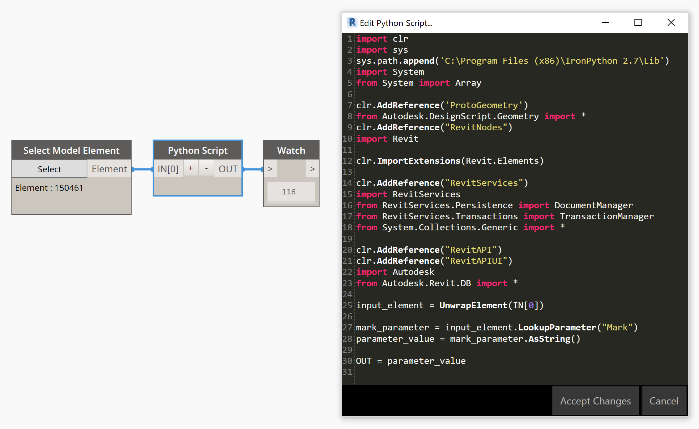

# Family Parameters

Revit's family system uses a hierarchical relationship between Family Types and Family Instances. The same relationship exists in parallel in the API:

* Placed family instances \(e.g. a window or a window\) are instance of Revit's [FamilyInstance](https://apidocs.co/apps/revit/2019/ea6bc434-d938-d0e5-ecc3-33e37dbf1d1b.htm) class.
* Family Types \(e.g. 90 minute fire-rated door type\) are instances of Revit's [FamilyType](https://apidocs.co/apps/revit/2019/e57e8440-14b8-5f33-e014-5fcae26f244a.htm) class.

#### Family Instance vs Family Type Parameters

It is worth understanding a simple fact about family parameters:

_A family's instance parameters are accessed via the FamilyInstance object, whereas family type parameters are accessed via the instance's FamilyType object._

Using a few simple methods, you can move from a family instance's FamilyInstance to its associated FamilyType, and from that FamilyType to the associated Family. We can also carry out the movements in reverse, finding all Family Types of a Family, or all placed instances of a Family Type. To make things clearer, we've put this on its own page:



#### Seeing All Family Instance Parameters

As ever, if wanting to interact with a Revit element passed into a node, it will need to be unwrapped. See how to unwrap elements here: [Unwrapping Revit Elements](../unwrapping-revit-elements.md)

Once unwrapped, you can either access a particular parameter \(see section on Accessing a Specific Parameter below\) or return a list of all the element's instance parameters as [Parameter](https://apidocs.co/apps/revit/2019/c0343d88-ea6f-f718-2828-7970c15e4a9e.htm) objects, which can be accessed via its Element.Parameters property, like so:

```python
#Boilerplate Code
my_element = UnwrapElement(IN[0])
element_parameters = my_element.Parameters
```

This is akin to using the Element.Parameters node on in Dynamo. Now we have the list of Parameter objects, we can do many things. Looking at the [Parameter](https://apidocs.co/apps/revit/2019/c0343d88-ea6f-f718-2828-7970c15e4a9e.htm) class in ApiDocs.co, we can see there are a number of useful properties we can inspect.

#### Seeing All Family Type Parameters

Type Parameters need to be accessed via an element’s family type. If you have a [FamilyInstance](https://apidocs.co/apps/revit/2019/0d2231f8-91e6-794f-92ae-16aad8014b27.htm) as an input, you’ll firstly need to use an intermediate method to get the element’s [FamilyType](https://apidocs.co/apps/revit/2019/7f15b213-c99b-db59-3622-3280757b82d9.htm) object, such as GetTypeId\(\).

This method returns the [ElementId](https://apidocs.co/apps/revit/2019/44f3f7b1-3229-3404-93c9-dc5e70337dd6.htm) of the element’s family type. We can then use the doc.GetElement\(\) method to return the element’s FamilyType object. We can assign a reference to the family type, such as:

```python
family_type = doc.GetElement(family_instance.GetTypeId())
```

The family\_type handle is now a way to access the family type object. We can then go about accessing parameters using the methods below.

#### Accessing a Specific Parameter

Once we've placed a handle to our FamilyInstance or FamilyType, there are a couple of different ways to access a particular parameter:

* The Element.LookupParameter\(\) method.
* The Element.get\_Parameter\(\) method.

Both of these methods essentially do the same thing; they return a Parameter object which you can inspect and manipulate.



#### Reading A Parameter's Value

Finally, in order to read a parameter object’s value, you’ll need to convert it using one of the methods of the Parameter class, such as .AsString\(\) or .AsDouble\(\).  
  
If you output the raw Parameter object, it shows as **Autodesk.Revit.DB.Parameter** which isn't very helpful. Use the methods above to return the value in an appropriate data type. This workflow is the equivalent of using the GetParameterValueByName node in Dynamo.

