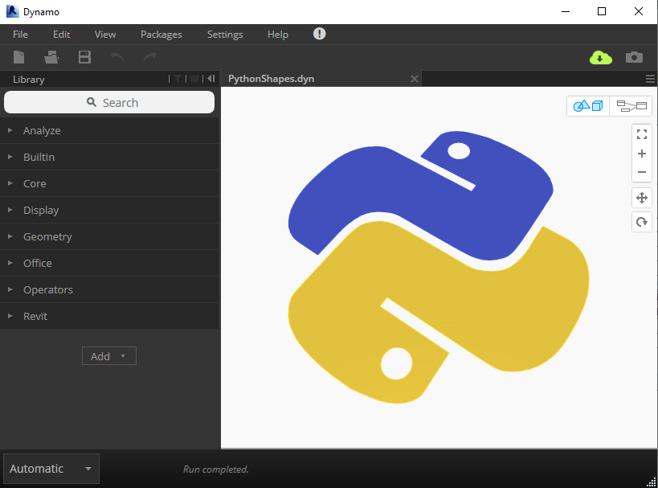

# Take Dynamo Further 🚀

#### Welcome!

Thanks for visiting the Dynamo Python Primer. Inspired by the amazing [Dynamo Primer](https://primer.dynamobim.org/), this guide aims to be the next step in bringing programming knowledge to keen Dynamo users.

#### What's All This About, Then?

Autodesk's Dynamo is an invaluable tool for AEC professionals; it lets you build automate workflows, analyse your designs, build parametric geometry and more. 

Python is one of the most popular programming languages in the world. It's highly flexible, easy to learn \(even for beginners\) and is used for everything from data visualisation to machine learning.

Brought together, they're more than the sum of their parts. Writing Python scripts in Dynamo will change the way you work for the better. 

**New to Coding?**

If you've never written a line of code before - don't panic! This guide is designed to help a confident Dynamo user take their first steps into programming with Python. It will introduce all the relevant topics step-by-step and will show you all the resources you need to take your custom tools further using Python.


#### Thoughts? Get in touch!

The Dynamo Python Primer remains a live guidance document and is open source, so we would love to receive your thoughts, feedback and pull requests!  
Contact details are [here](about-this-primer.md).


