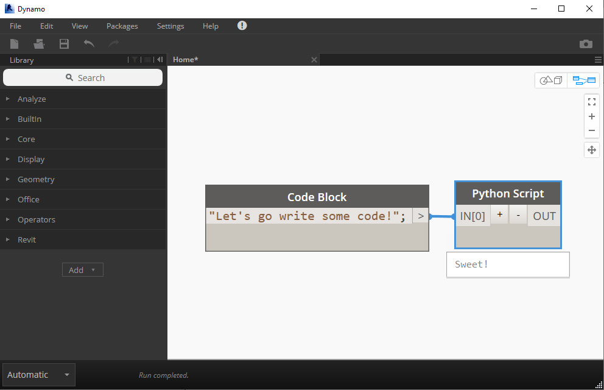

# 3 Getting Started 🛴

This chapter shows you how to write your first Python code in Dynamo.

It explains fundamental ideas such as importing the necessary libraries, handing inputs & outputs and finishes by explaining some commonly-seen errors.

