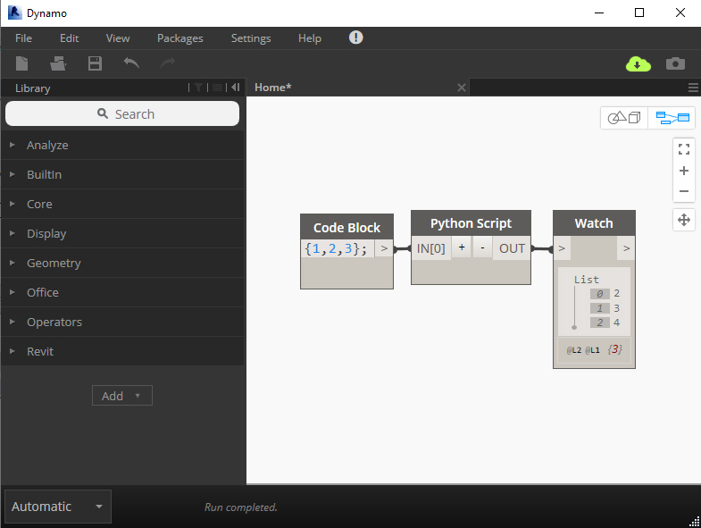

# 3.3 Basics: Input and Output

#### Inputs and Outputs

**IN** and **OUT** are important keywords in Dynamo's Python node. The 'IN' keywords tells the node to refer to any data which is sent to the node via its inputs. 


Don't forget your scripts will always need [boilerplate code](boilerplate-setup-code.md) up top!


The various inputs are accessed via their indexes, like the list\_of\_numbers below:

```python
#Boilerpate Code Always Goes Up Top! Don't forget it!

input_list_of_numbers = IN[0] #Here we take an input
output_list_of_numbers = [] #We create an empty list to output

for number in input_list_of_numbers: #Looping through input
    new_number = number + 1 #Adding 1 to each number
    output_list_of_numbers.append(new_number)

OUT = output_list_of_numbers #Here we output the new '+1' list
```

In this example, we're initially creating an empty list for our output. We loop through each number in the input list and add its incremented version to our output list. Finally, we output the incremented list via the 'OUT' keyword.

In practice, it looks like this: 



#### 

#### Kinds of Inputs and Outputs

The Dynamo node can take any kind of data as an input and output any kind of data as an output. It is able to take element \(e.g. Revit elements\), abstract numbers, strings, Dynamo geometry and everything else as inputs.

However, there is one caveat when inputting Revit elements to a Python node. Revit elements need to be 'unwrapped' before they can be accessed via the API. Learn more about unwrapping elements here:



