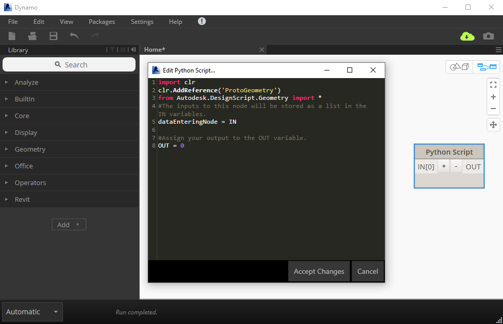

# 3.1 Dynamo's Python Node

#### Dynamo's Python Script Editor

The Python Script node comes with any default installation of Dynamo and, in many ways, it's just like any other node: it can be placed on the workspace, renamed and can take any number of inputs.

However, unlike other nodes, if you right-click and select **Edit...** a script editing window will appear, like so:

In this window, you are able to write IronPython scripts which will be directly executed as part of a Dynamo definition. To save your script, click the 'Accept Changes' button and then save the Dynamo definition it's in. Otherwise, click the 'Cancel' button to discard any changes made.

#### Are We There Yet?

You are \*so close\* to being able to write your first Python code for Dynamo!   
The final piece of the puzzle is to learn about boilerplate setup code, which you'll find in the next section in this chapter.

