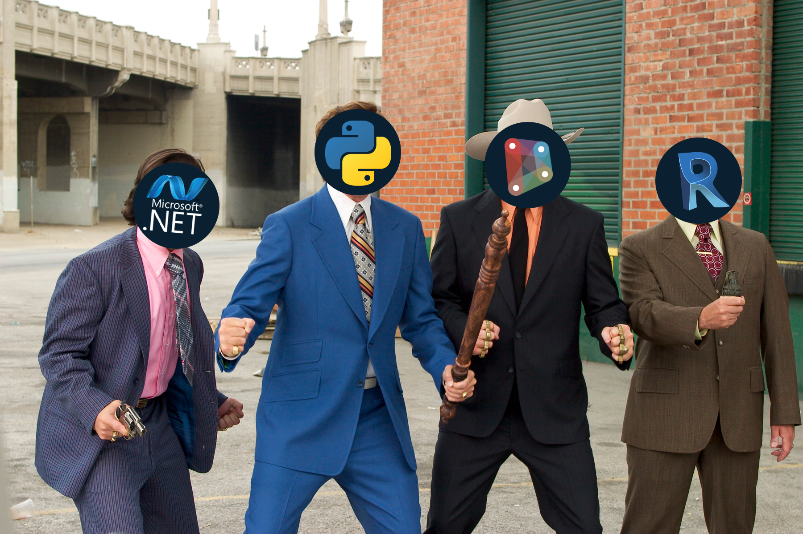

# 2.1 Context Matters

#### Languages Require Context

Programming languages sometimes make more sense when viewed under the same lens as spoken languages as they share several important features. One such feature is that languages are always used in some ****_context_: ****why are we speaking in the first place?

Let's imagine you own a villa in France and after some time a property boundary dispute arises. To resolve this, you would need to know several things:

* The French language
* French property law
* Who your neighbours are
* What is the nature of the dispute?

While knowing how to speak the right language is helpful, it won't let you solve the boundary dispute by itself. This is much the same with programming languages. 


While knowing the right language is helpful, it's only the first step. You'll need to know the context to resolve the problem.


Learning the Python language is a first step, and it's not too hard to do. However, learning the context you wish to apply a language in is equally important. Our next section covers the technologies we'll encounter when using Python in Dynamo.

#### Getting to Know the Gang

Learning the context involves becoming familiar with a few new technologies.  
Becoming a Python-Dynamo master requires knowledge of:

* The [IronPython](../hello-python/what-is-ironpython.md) programming language
* Your application's API \(e.g. the Revit API\)
* [The .NET Framework](what-is-the-.net-framework.md)
* Dynamo's API

Don't worry about that list too much, this guide only assumes you know how to write a little Python \(don't know Python yet? Start [here](../hello-python/python-introduction.md)!\). The scripts you'll be writing will be employing a few lines of each of these technologies but you won't need to know them all back-to-front!

